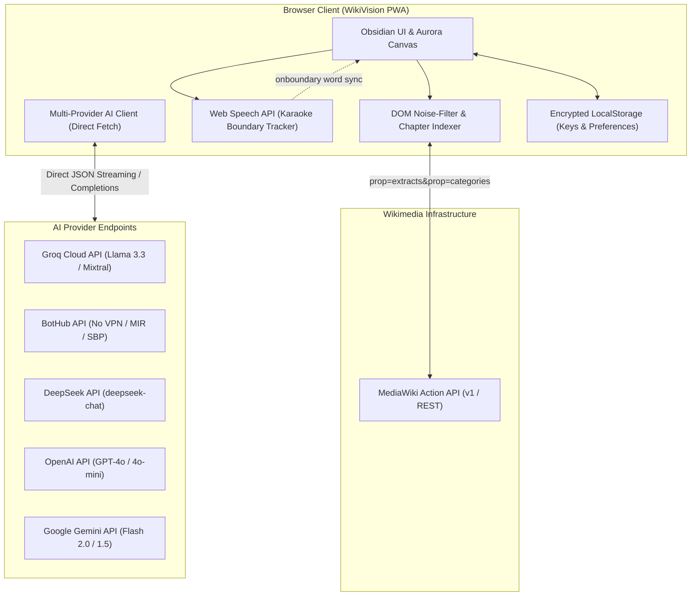

<div align="center">

# 🌟 WikiVision `v1.0-beta`
### *AI-Powered Smart Book Reader for Wikipedia*

Turn any Wikipedia article into an immersive, distraction-free audiobook experience with real-time word-by-word karaoke synchronization and on-demand AI explanations for complex concepts.

[](https://github.com/Rakysha/wiki-vision/releases)
[](https://opensource.org/licenses/MIT)
[-success.svg?style=for-the-badge)](#-zero-dependency-architecture)
[](#-multi-provider-ai-mentor)
[](#-mobile--pwa-support)

<br/>

[**English**](#-overview) • [**Русский**](#-обзор-проекта-на-русском) • [**Quickstart**](#-quickstart) • [**Architecture**](#-architecture) • [**Security & Privacy**](#-security--privacy-first)

---

</div>

## 📖 Overview

Standard Wikipedia reading is plagued by visual noise: inline citation brackets (`[1]`, `[note 2]`), cumbersome infobox tables, hatnotes, and abrupt scientific jargon.

**WikiVision** reimagines encyclopedic content as a **distraction-free digital book**:
- 🎙️ **Synchronous Voice Synthesis:** High-fidelity TTS with real-time word-by-word highlight and smooth autoscroll.
- 🧠 **Contextual AI Mentor:** Instant "Explain Like I'm 5" analogies, etymology, and paragraph-level context for any word with one click.
- 🎨 **Iridescent Aurora Design System:** 60 FPS animated Apple Mesh gradients, Obsidian Glassmorphism, and editorial typography (`DM Sans` + `Onest`).
- ⚡ **Zero-Dependency Core:** Built purely on Web Standards (ES6+, CSS3 Custom Properties, Web Speech API, Service Worker) with an ultra-light Python static runner.

---

## ✨ Key Features

| Feature | Description |
| :--- | :--- |
| **🎙️ Karaoke Highlighting** | Tracks exact speech synthesis word boundaries (`SpeechSynthesisUtterance.onboundary`) to highlight current words in real-time. |
| **🤖 7 AI Providers** | Out-of-the-box integration with **Groq**, **BotHub**, **DeepSeek**, **OpenAI**, **Google Gemini**, **Anthropic Claude**, and **OpenRouter**. |
| **📑 Noise-Stripping Parser** | Cleans Wikipedia DOM on the fly: strips citation anchors, infobox tables, navboxes, edit markers, and coordinates. |
| **🔞 Multilevel Content Guard** | Deep category and extract scanning (up to 150 MediaWiki categories) with a safety curtain for sensitive or NSFW articles. |
| **📱 Mobile & PWA Ready** | Standalone PWA mode with offline caching (`sw.js`), touch gestures, and full mobile browser compatibility. |
| **🌗 Adaptive Theme Engine** | Instant switching between high-contrast dark (*Obsidian Glass*) and light (*Warm Editorial*) modes. |

---

## 🏗️ Architecture

WikiVision operates on a **client-first, zero-telemetry architecture**. All article retrieval and AI inference calls are dispatched directly from the client's browser to authoritative endpoints.



---

## 🤖 Multi-Provider AI Mentor

Click any word or press `Alt + E` to summon an instant breakdown:
1. **Analogy «On Fingers»:** Intuitive real-world metaphor explaining the concept.
2. **Context Role:** How this specific term relates to the current paragraph.
3. **Etymology:** Origin of the word and linguistic roots.

| Provider | Model | Latency | RU/CIS Accessibility | Free Tier Available |
| :--- | :--- | :--- | :--- | :--- |
| **Groq** | `llama-3.3-70b-versatile` | ⚡ ~250ms | Direct (No VPN) | ✅ Yes (Free tier) |
| **BotHub** | `gpt-4o` / `deepseek-chat` | ⚡ ~500ms | Direct (No VPN, MIR/SBP) | 💳 Paid balance |
| **DeepSeek** | `deepseek-chat` | ⚡ ~600ms | Direct (No VPN) | 💰 Ultra-low cost |
| **OpenAI** | `gpt-4o-mini` | ⚡ ~700ms | Requires VPN | 💳 Pay-per-use |
| **Google Gemini** | `gemini-1.5-flash` | ⚡ ~400ms | Requires VPN | ✅ Free tier |
| **Anthropic** | `claude-3-5-haiku` | ⚡ ~600ms | Requires VPN | 💳 Pay-per-use |
| **OpenRouter** | 200+ models | Variable | Depends on route | 💳 Pay-per-use |

---

## 🚀 Quickstart

### 🪟 Windows (One-Click)
Double-click **`run.bat`** or run in terminal:
```cmd
.\run.bat
```
*The launcher checks your configuration, prompts for an optional AI key, and automatically starts the reader at `http://localhost:8080`.*

---

### 🐧 Linux & 🍏 macOS
```bash
chmod +x run.sh
./run.sh
```

---

### 📦 Node.js / NPM
```bash
npm start
```

---

### 🐍 Direct Python Standard Library
```bash
python web-reader/server.py --port 8080
```

---

### 📱 Testing on iPhone / Android (Remote HTTPS Tunnel)
To test on mobile devices without USB debugging, run an instant HTTPS tunnel:
```bash
npm run tunnel
# or: npx localtunnel --port 8080
```
Open the generated `https://xxxx.loca.lt` URL in your mobile browser (Safari / Chrome).

---

## 🔒 Security & Privacy-First

- **Zero Credentials in Git:** The project is configured with strict `.gitignore` rules. Sensitive files (`config.env`, `web-reader/config.local.json`) are permanently ignored.
- **Client-Side Execution:** Your API keys never leave your machine. Requests to Groq, BotHub, DeepSeek, or OpenAI are executed directly in your browser.
- **No Middleman Logging:** There is no tracking server, analytics proxy, or database collecting user browsing queries.

---

## ⌨️ Keyboard Shortcuts

| Shortcut | Action |
| :--- | :--- |
| <kbd>Space</kbd> | Toggle Play / Pause reading |
| <kbd>Alt</kbd> + <kbd>E</kbd> | Explain word under cursor / open AI mentor |
| <kbd>Esc</kbd> | Close AI modal or dismiss settings drawer |
| <kbd>K</kbd> | Jump to Table of Contents |
| <kbd>T</kbd> | Toggle Dark / Light theme |

---

## 📂 Project Directory Structure

```text
wiki-vision/
├── LICENSE                     # MIT Open Source License
├── README.md                   # Project documentation & benchmarks
├── SECURITY.md                 # Security disclosure & privacy policy
├── package.json                # Project metadata & standard npm scripts
├── .gitignore                  # Strict leak prevention & build ignore rules
├── .env.example                # Example environment variables
├── run.bat                     # Windows automated launcher & key configurator
├── run.sh                      # Linux/macOS cross-platform startup script
└── web-reader/                 # Web application root
    ├── index.html              # Modern semantic DOM & Aurora backdrop
    ├── style.css               # Iridescent Aurora Mesh & Glassmorphism system
    ├── app.js                  # Engine: TTS karaoke, AI clients, DOM parser
    ├── server.py               # Zero-dependency Python 3 HTTP server
    ├── manifest.json           # Progressive Web App (PWA) manifest
    ├── sw.js                   # Service Worker (offline shell cache)
    ├── config.example.json     # Template browser configuration
    ├── config.local.json       # User local keys (GIT-IGNORED)
    └── assets/                 # SVGs, flags & high-res PWA icons
```

---

## 🇷🇺 Обзор проекта на русском

**WikiVision v1.0-beta** — это интеллектуальный книжный ридер для статей Википедии с современным интерфейсом и ИИ-ментором.

### Чем проект отличается от стандартной Википедии:
1. **Караоке-озвучка:** в отличие от стандартных читалок, система подсвечивает каждое произносимое слово синхронно с голосом и автоматически плавно прокручивает страницу.
2. **ИИ-ментор без VPN:** для пользователей из РФ поддержан шлюз **BotHub** (оплата картами МИР/СБП) и ультра-быстрый бесплатный **Groq**. Кликните на любое незнакомое слово — ИИ объяснит термин простыми жизненными аналогиями.
3. **Очистка от шума:** алгоритм на лету вырезает сноски `[1]`, служебные плашки, громоздкие таблицы и инфобоксы, превращая статью в приятную книгу.
4. **Безопасность:** многоуровневый фильтр деликатного контента 18+ (насилие, взрослые темы) с предупреждающей шторкой.
5. **Безупречная приватность:** нулевой сбор данных, API-ключи хранятся только локально в браузере.

---

## 🗺️ Roadmap (Upcoming Features)

- [ ] Multi-voice dialog mode (different voices for quotes and main text).
- [ ] Export article to synchronized MP3 + LRC audiobook format.
- [ ] Offline local LLM support via WebGPU (`transformers.js` / WebLLM).
- [ ] PDF and EPUB import support.

## 👥 Authors & Co-Authors

- **Lead Architect & Developer:** [Rakysha](https://github.com/Rakysha)
- **AI Co-Author & Pair Programmer:** [Claude](https://www.anthropic.com) (Anthropic)

---

## ⚖️ Legal Disclaimer

*WikiVision is an independent open-source project created strictly for educational, accessibility, and entertainment purposes. Wikipedia®, Wikimedia®, and related marks are registered trademarks of the Wikimedia Foundation. WikiVision is not endorsed by or affiliated with the Wikimedia Foundation.*

---

<div align="center">
  <sub>Built with care for curious minds. Distributed under the <b>MIT License</b>.</sub>
</div>
